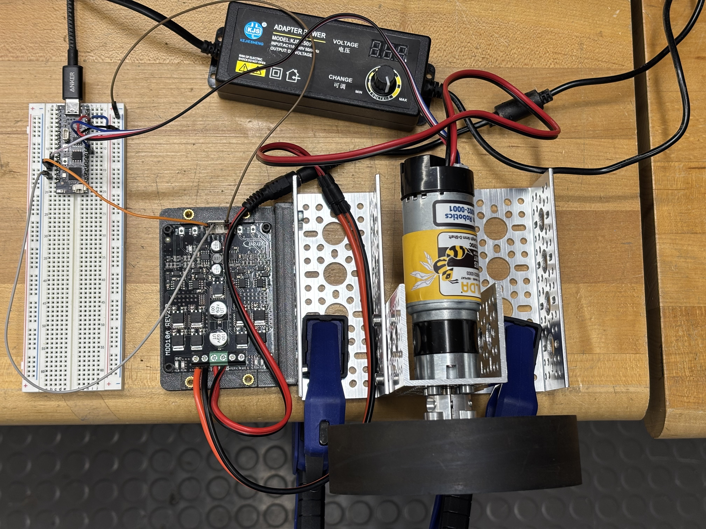
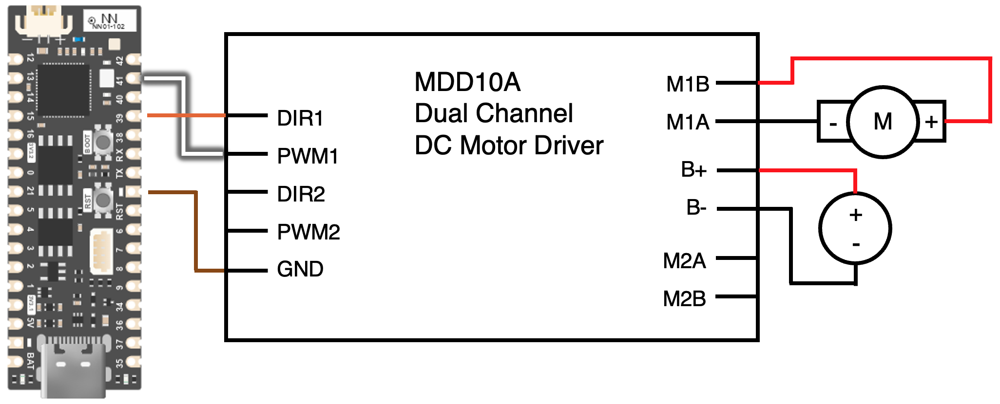
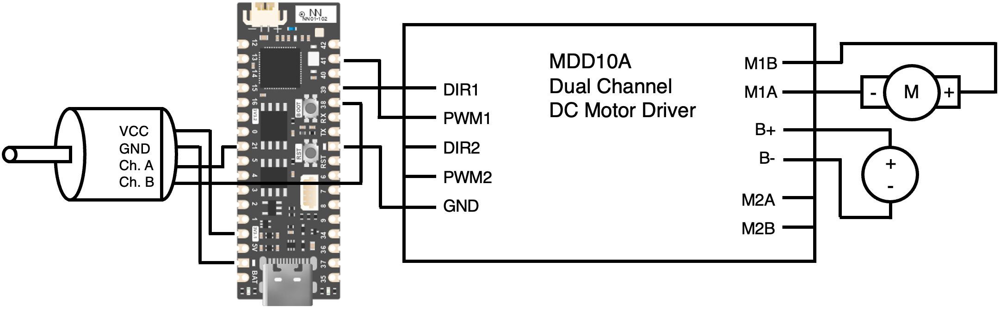
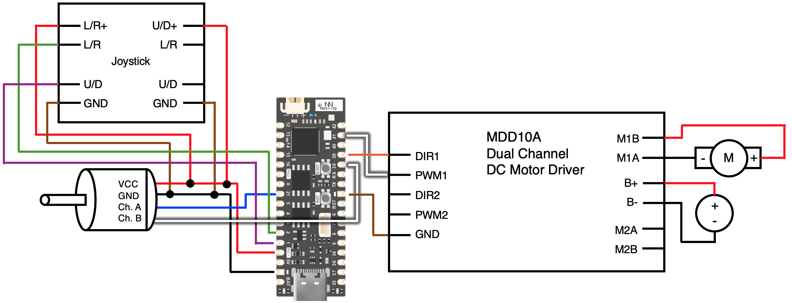

# Lab 1: DC Motor Basics

2.12/2.120 Intro to Robotics  
Spring 2026[^1]

## Table of Contents
- [Lab 1: DC Motor Basics](#lab-1-dc-motor-basics)
  - [Table of Contents](#table-of-contents)
  - [1 Software Set Up](#1-software-set-up)
    - [1.1 Visual Studio Code (VSCode)](#11-visual-studio-code-vscode)
    - [1.2 PlatformIO Extension](#12-platformio-extension)
    - [1.3 C/C++ Extension](#13-cc-extension)
    - [1.4 Git](#14-git)
  - [2 Hardware Set up](#2-hardware-set-up)
  - [3 Validating the Microcontroller](#3-validating-the-microcontroller)
    - [3.1 Git Clone](#31-git-clone)
    - [3.2 Uploading Code on the Microcontroller](#32-uploading-code-on-the-microcontroller)
  - [4 Validating the Motor](#4-validating-the-motor)
    - [4.1 Motor Driver Actuation](#41-motor-driver-actuation)
    - [4.2 Wiring up the Motor and Microcontroller](#42-wiring-up-the-motor-and-microcontroller)
    - [4.3 Microcontroller Actuation](#43-microcontroller-actuation)
  - [5 Validating the Encoder](#5-validating-the-encoder)
    - [5.1 Wiring up the Encoder and Microcontroller](#51-wiring-up-the-encoder-and-microcontroller)
    - [5.2 Testing the Encoder](#52-testing-the-encoder)
  - [X Optional](#x-optional)
    - [X.1 Controlling the Motor via Joystick](#x1-controlling-the-motor-via-joystick)
      - [X.1.1 Motor Position Control](#x11-motor-position-control)
      - [X.1.2 Wiring up the Joystick](#x12-wiring-up-the-joystick)
      - [X.1.3 Printing Joystick Input](#x13-printing-joystick-input)
      - [X.1.4 Put It All Together!](#x14-put-it-all-together)

## 1 Pre-lab and Software Set Up

Before starting the lab, take a picture of the components on your benchtop. **Before leaving, you must return everything to the exact same state as the beginning of the lab, with all the components laid out.**

Please install the following software. Although you are working in pairs today, both of your machines should have all of these software.

### 1.1 Visual Studio Code (VSCode)

1. Download VSCode here: https://code.visualstudio.com/Download.
2. Follow installation instructions. When prompted for which extensions you want to install, refer to the next two sections.
<details>
<summary><i> Can I use a different code editor? </i></summary>

We prefer VSCode since we will use the [PlatformIO plug-in](#12-platformio-extension).
</details>

### 1.2 PlatformIO Extension

PlatformIO is an open-source ecosystem for IoT development with support for various microcontroller platforms. The PlatformIO extension in VSCode provides a seamless environment for embedded systems programming. We will be using the Arduino ecosystem in PlatformIO, so if you are familiar with programming microcontrollers using the Arduino IDE, the code will look familiar.

1. Open the VSCode application.
2. Go to the Extensions tab by clicking on the Extensions icon in the Activity Bar on the left side of the window (5th from the top).
3. Search for "PlatformIO IDE" by PlatformIO and click "Install".

### 1.3 C/C++

Since the code we need for the microcontroller is based on C++, we also need a C++ extension in VSCode for context-aware code completion. This helps speed up the coding process and reduce bugs.

1. Repeat the process in the [previous section](#12-platformio-extension) to navigate to the Extensions tab.
2. Search for "C/C++" by Microsoft and click "Install". We want the extension that only says "C/C++".
    <details>
    <summary><i>Can't find "Install"? </i></summary>

    If you don't see "Install" and instead only see "Uninstall", you must already have this extension!
    </details>

### 1.4 Git 

Git is a distributed version control system that allows for efficient collaboration and tracking changes in code. We will use Git to manage our code repositories.

1. Download Git here: https://git-scm.com/downloads. 
2. Follow installation instructions. 

## 2 Hardware Set up

For today's lab, you should have the following parts:
- DC motor set up (which we have already assembled for you)
- Motor driver
- Power supply
- ESP32-S3 microcontroller (https://esp32s3.com/)
- Breadboard
- Jumper cables
- USB-C cable

<p align="center">

</p>

## 3 Validating the Microcontroller

Before connecting the microcontroller to the rest of the system, we want to make sure it works on its own.

### 3.1 Git Clone

This GitHub repository contains all the code you need for this lab. In order to make a local copy of this repository, you need to *clone* it. For all Git operations in this class, we will use VSCode's built-in Source Control. Both of you must do this section.
1. Open the VSCode application.
2. Go to the Source Control tab by clicking on the Source Control icon in the Activity Bar on the left side of the window (3rd from the top).
3. Click "Clone Repository". If you don't see a button to do so, hover over the "Source Control" text with a drop-down arrow to the left of it, click on the three dots that appear to the right, and click "Clone".
    1. You may need to "Initialize Repository" before seeing any of the options mentioned above
5. Enter "https://github.com/mit212/lab1_2026" on the bar that appears at the top of the window.
6. Select "Clone from URL" from the dropdown.
7. Navigate to the directory where you want your lab code files to be saved. Git will create a new folder called `lab1_2026` within that directory to contain all files in this repository. Click "Select as Repository Destination".
8. In the pop-up window asking whether you would like to open the cloned repository, click "Open".
9. In the succeeding pop-up window asking whether you trust the authors of the files in the folder, click "Yes, I trust the authors".

Note: In the future, if you need to view or edit a repository you have already cloned, just click "Open Folder" when you first launch the VSCode application and select the cloned folder, e.g. `lab1_2026` folder. Make sure to open the entire folder/project you are working on, not just the file you want to upload.

### 3.2 Uploading Code on the Microcontroller
Now that you have the code on your machine, you can *upload* it on the microcontroller. This is a process we will repeat not only in this lab but throughout the semester, so try to remember the steps! We will first upload a simple test that changes the color of the onboard LED.

1. Open `src/robot/blink_test.cpp`. To verify that the code compiles, first *build* the code by clicking the check mark at the bottom of the screen. A terminal window will open to report progress as your code builds. Once done, it should say `SUCCESS`. 
  

    <details>
    <summary><i> What does compiling code mean? </i></summary>

    Compiling converts source code (human readable) into machine code (machine executable). The process verifies that the code is written correctly.

    </details>
2. Connect the microcontroller to your machine using a USB-C cable.
3. Put the microcontroller into *download* mode by holding down the onboard `BOOT` button, clicking the adjacent `RST` button, and then releasing `BOOT`. **Depending on your machine, you may have to do you this every time you want to upload code on your microcontroller.** Hold the buttons for 2-3 seconds!

4. Click the right arrow at the bottom of the screen to upload the code on the microcontroller. The upload process also includes compiling so if you only make small changes in the future, you don't need to build before uploading.
  

    <details>
    <summary><i> Upload failed? COM port doesn't exist? </i></summary>

    Delete the `.pio` folder and put the microcontroller into *download* mode again. The onboard LED on the microcontroller **should be off** when it is in *download* mode. Make sure you clicked `RST` **while you are still holding down** `BOOT`. You should only let go of `BOOT` after you have let go of `RST`. 

    You can also try manually selecting the upload port. Click the plug icon next to "Auto" at the bottom of the screen and try the options that appear at the top of the screen.

    
    </details>

5. Run the code by clicking `RST`. You should see the onboard LED change colors!

    <details>
    <summary><i> Code doesn't run? </i></summary>
    Try closing the terminal by pressing Ctrl+C, then unplugging and replugging the USB cable to your PC. The ESP32 boards are a bit finnicky, so feel free to try multiple rounds of uploading/resetting/unplugging the USB/etc.
    </details>

     <details>
    <summary><i> Code STILL doesn't run? </i></summary>
    1. Set LED brightness to 255 (instead of 255/3). <br>
	     2. Add the line "Serial.begin();" to your code inside the "setup" function. <br>
	     3. Add the line "Serial.println(String(color));" inside the "loop" function.
    </details>

6. For the lab partner who did not get to use their machine to upload code on the microcontroller yet, open `src/robot/blink_test.cpp`.
7. Modify the code in line `20` to increase the delay to `60`.
8. Save the file and repeat steps 1 to 5. You should notice that the speed at which the onboard LED changes colors is much slower!

Note: In this lab, we configured PlatformIO to compile and upload only the files within the `src/robot/` directory. Since all the other `.cpp` files are outside this directory, only `blink_test.cpp` was ran. This means that if you want to run a different `.cpp` file, you will have to rearrange the files by taking out `blink_test.cpp` and adding in that `.cpp` file to the `src/robot/` directory.

## 4 Validating the Motor

Now that we have confirmed the microcontroller is working, we want to test the motor and motor driver. From this section onwards, you may choose to only work on one of your machines.

### 4.1 Motor Driver Actuation

We will start by actuating the motors using only the motor driver. 
1. Connect the motor power cables to the motor driver cables (black to black and red to orange).
2. Plug in the power supply output to the motor driver input. 
3. Push and hold either of the `M1A` and `M1B` buttons on the motor driver to see the wheel spin! Each button should spin the wheel in opposite directions. 
4. The power supply has a knob to vary its output voltage. Try changing this to about `10V`, `7V`, then `3V`. Notice that the wheel spins slower at lower voltages, and doesn't spin at all below certain voltages! This is because the motor driver has a lower limit it needs to surpass in order to function. 
5. Change the output voltage back to about `12V`.

### 4.2 Wiring up the Motor and Microcontroller 
We will then wire the motor driver to the microcontroller so that we can use code to command the motors. 

1. Open `include/pinout.h` and find the assigned motor `DIR1` and `PWM1` pin numbers. 
2. Use the jumper cables to connect the following:
    | motor driver | microcontroller | suggested cable color |
    | ------------- | ------------- | ------------- |
    | `DIR1`  | from `pinout.h`  | orange |
    | `PWM1`  | from `pinout.h` | white |
    | `GND` | **`-`** or `GND`| black or brown |

    Note: We have suggested jumper cable colors for convention, but remember that the **colors alone don't mean anything**! If you see a black jumper cable in the future, don't automatically assume that it must be ground.

    <details>
    <summary><i> Nothing is happening!</i>
    </summary>

    Make sure you wired up the motor driver and **not the encoder**! The motor driver is the **PCB** you connected to the power supply output, while the encoder is the black cylinder attached to the end of the motor.
    </details>

    <details>
    <summary><i> How do I use a breadboard?</i>
    </summary>

    Please refer to this [online guide](https://learn.sparkfun.com/tutorials/how-to-use-a-breadboard/) or approach a TA or LA for a crash course!
    </details>
    
3. Examine the *schematic* diagram below and confirm that it corresponds to the wiring you just did. Make sure you completely understand the correspondence as you will only be provided with a schematic for the next wiring task! Feel free to clarify with a TA or LA if needed.
<p align="center">

</p>

### 4.3 Microcontroller Actuation
   
Finally, we will upload the provided motor test code on the microcontroller! Repeat the process outlined in the [previous section](#22-uploading-code-on-the-microcontroller) to run `motor_drive_test.cpp` instead of `blink_test.cpp`. The wheel should spin in different directions with varied speeds.

<details>
<summary><i> Nothing is happening?</i>
</summary>

As noted at the end of the [previous section](#32-uploading-code-on-the-microcontroller), make sure you have rearranged the files in the `src` directory so that `motor_drive_test.cpp` is in the `robot` subfolder and everything else is in the `test_code` subfolder. PlatformIO will only compile the files in the `src/robot/` directory. 
</details>

| :white_check_mark: CHECKOFF 1 :white_check_mark:   |
|:---------------------------------------------------|
| Demonstrate `motor_drive_test.cpp` to a TA or LA. |

## 5 Validating the Encoder

We can now test our entire system consisting of the microcontroller, motor, motor driver, and encoder. 
<details>
  <summary><i> What is an encoder?</i>
  </summary>
  An encoder is a sensor that measures the position and/or speed of a motor's shaft by converting motion to an electrical signal, thereby enabling motion feedback and control.
</details>

### 5.1 Wiring up the Encoder and Microcontroller 

Using what you learned about reading schematics in the [previous section](#32-wiring-up-the-motor-and-microcontroller), wire up the encoder to the microcontroller based on the schematics below! 

<p align="center">

</p>

Hint: You only need to connect the 4 encoder wires to the microcontroller through the breadboard. NOTE: the encoder A and encoder B pins are INTENTIONALLY reversed in `include/pinout.h`. Please wire the encoders according to the diagram.

### 5.2 Testing the Encoder
To see the encoder in action, we will upload the provided encoder test code on the microcontroller.
1. Ensure that the motor driver is powered off by unplugging the power supply cable connection.
2. Upload and run `encoder_basic_test.cpp`. 
3. Open the Serial Monitor by clicking the plug icon at the bottom of the screen.
   
4. Rotate the wheel by hand. By looking at the counts printed in the Serial Monitor, estimate how many encoder counts it takes per revolution. Observe that counter-clockwise motion increases the encoder count, while clockwise motion decreases it!
5. Upload and run `encoder_test.cpp`. 
6. Rotate the wheel. Confirm that the position and velocity readings make sense!

| :white_check_mark: CHECKOFF 2 :white_check_mark:   |
|:---------------------------------------------------|
| Demonstrate `encoder_test.cpp` to a TA or LA. |

## X Optional 

If you finished lab early, here's a few optional challenges you can try!

### X.1 Controlling the Motor via Joystick

The goal for this challenge is to use a joystick to dictate the position of the motor. 

#### X.1.1 Motor Position Control

We have provided code that performs basic motor position control with PID. We first want you to get familiar with this code.
1. Open `motor_position_control.cpp` and read its contents.
2. Plug in the power supply output to the motor driver input.
3. Upload and run `motor_position_control.cpp`. You should see the wheel cycle back and forth.

#### X.1.2 Wiring up the Joystick

Please ask a TA or LA for a joystick. Refer to the schematic below to wire it to the rest of the system.

<p align="center">

</p>

Your setup should look something like this:
<p align="center">

</p>

#### X.1.3 Printing Joystick Input

We will now write some code to collect and print input from the joystick. 
1. Right-click on the `robot` subfolder and click "New File...".
2. Name the file `motor_joystick_control.cpp`. It is important that you include `.cpp` in the filename.
3. Copy this code:

```
#include <Arduino.h>

void setup(){	
	Serial.begin();
}

void loop(){
	int UD_pot = analogRead(1);
    	int LR_pot = analogRead(2);
	Serial.println("LR: " + String(LR_pot) + ", UD: " + String(UD_pot));
	delay(100);
}
```

4. Upload and run `motor_joystick_control.cpp`. You should see the positions of the two potentiometers of the joystick print on the Serial Monitor!

<details>
    <summary><i> Code doesn't run? </i></summary>
    Make sure that `motor_joystick_control.cpp` is the only file in your `robot` folder!
</details>

#### X.1.4 Put It All Together!

Combine `motor_joystick_control.cpp` and `motor_position_control.cpp` so that the `setpoint` in `motor_position_control.cpp` is dictated by either `x` or `y` in `motor_joystick_control.cpp`. Remember to include a scaling factor to convert between the 12 bit analogRead output (0-4095) and the desired setpoint in radians.

<details>
    <summary><i> Motor not behaving? </i></summary>
    Try playing with the gains at the top of the file. You may need to reduce the proportional gain, Kp, to make the controller less "stiff."
    You should also try switching between position and velocity control modes. You can do this by changing one of the inputs to the function `calculateParallel`. How does this change affect the joystick-to-motor relationship?
</details>


| :white_check_mark: OPTIONAL CHECKOFF 3 :white_check_mark:   |
|:---------------------------------------------------|
| Demonstrate your very cool joystick-controlled motor to a TA or LA! |


[^1]: Version 1 - 2024: Joseph Ntaimo, Josh Sohn, Jinger Chong  
  Version 2 - 2025: Roberto Bolli, Kaleb Blake  
  Version 3 - 2026: Stephan Stansfield